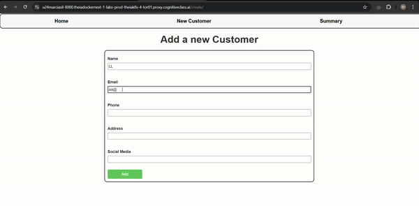

# Customer360 Application

Course: [Django Application Development with SQL and Databases](https://www.coursera.org/learn/developing-applications-with-sql-databases-and-django?specialization=ibm-full-stack-cloud-developer) - [IBM Full Stack Software Developer](https://www.coursera.org/professional-certificates/ibm-full-stack-cloud-developer)

## Table of contents

- [Overview](#overview)
- [Demo](#demo)
- [Project Features](#project-features)
- [Getting Started](#getting-started)


## Overview
This is the practice project of the Django Application Development with SQL and Databases course. The Customer360 application is a Django-based project designed to consolidate customer communication records in a single, centralized location. This application allows your organization to store and manage customer interactions efficiently, including capturing communication records and displaying recent interactions. The app supports professional customer management by providing insights into interactions from the last 30 days.

## Screenshots


## Project Features
The application includes the following main features:
  - **Communication Record Capture:** Enables the entry of customer communication records, including fields for channel, direction (inbound or outbound), and a summary of the communication.
  - **Interaction Display:** Displays a list of customer interactions from the last 30 days for easy tracking and customer management.
  - **Professional Management Interface:** Provides a user-friendly management interface for storing, viewing, and analyzing customer communication records.

## Getting Started
Prerequisites
  To run this project locally, ensure you have the following installed:
    - Python 3.11
    - Django

Installation
  - Clone this repository to your local machine. 
  - Navigate to the project directory.
  - Install required packages
    ``` bash
    pip install -r requirements.txt
    ```
  - Run Migrations
    ``` bash
    python3.11 manage.py migrate
    ```
  - Start the Django application:
    ``` bash
    python3.11 manage.py runserver
    ```
